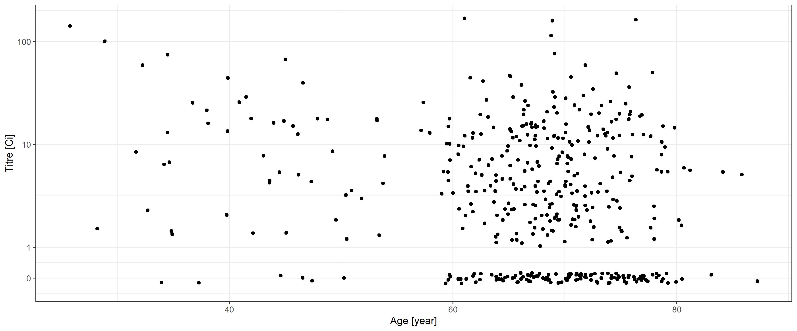
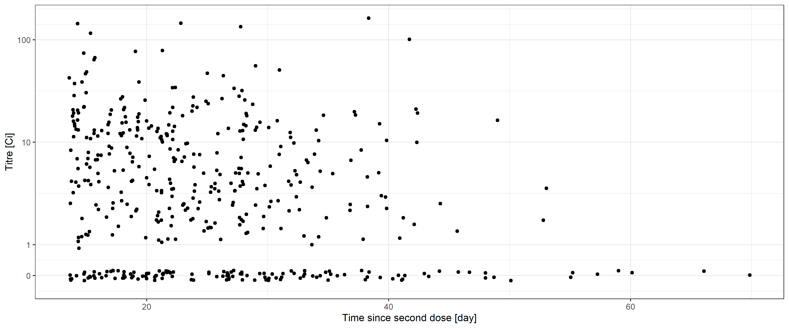
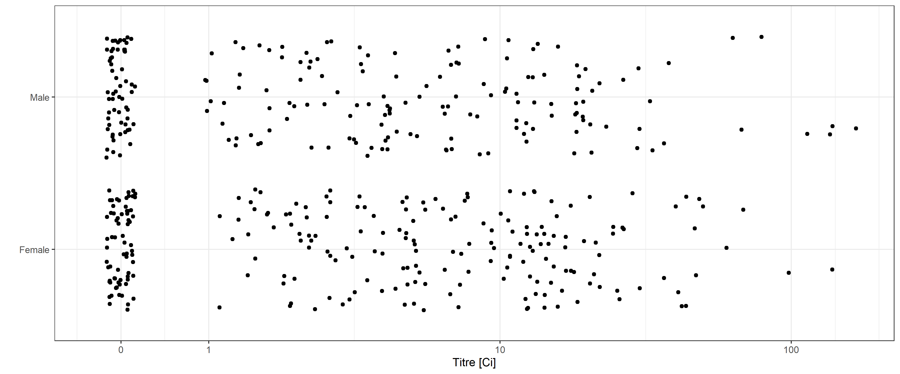
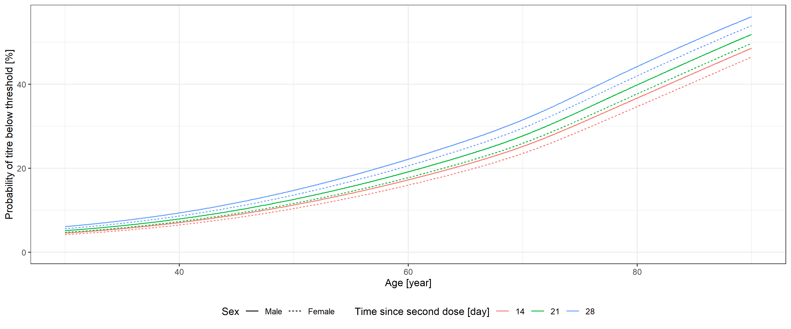

Virus neutralizing antibody responses after two doses of BBIBP-CorV
(Sinopharm, Beijing CNBG) vaccine
================
Tamás Ferenci, Balázs Sarkadi

We first load the necessary libraries:

``` r
library(data.table)
library(ggplot2)
library(brms)
theme_set(theme_bw())
```

## Availability of de-identfied individual patient level data

De-identfied individual patient level data are openly available to the
public at the homepage of the Kelen Hospital:
[Sinopharm](https://kelen.hu/wp-content/uploads/2021/07/sinopharmanonymousdata.xlsx)
(450 subjects) and
[Pfizer](https://kelen.hu/wp-content/uploads/2021/07/pfizeranonymousdata.xlsx)
(45 subjects).

To illustrate the methods, we will now analyze the Sinopharm
measurements. We first read the raw data:

``` r
RawData <- as.data.table(rio::import(
  "https://kelen.hu/wp-content/uploads/2021/07/sinopharmanonymousdata.xlsx"))
RawData2 <- RawData
RawData2[Titer==0]$Titer <- 0.5
```

(`RawData2` is only needed for visualization purposes.)

That is, `RawData` has four variables:

-   `Age` is the age of the subject, measured in years (greater than or
    equal to 18 in the present study).
-   `Sex` is the sex of the subject, either Male or Female.
-   `DaysAfterSecondDose` is the time since the second dose, measured in
    days (greater than or equal to 14 days in the present study).
-   `Titer` is the neutralizing antibody titer measured in Ci (Centaur
    index) arbitrary unit. Non-negative real number.

## Univariate investigations

Distribution of the subject’s age, according to sex:

``` r
ggplot(RawData, aes(x = Age, color = Sex)) + stat_density(geom = "line") +
  labs(x = "Age [year]", y = "", color = "Sex")
```

<!-- -->

Distribution of time since second dose:

``` r
ggplot(RawData, aes(x = DaysAfterSecondDose)) + geom_histogram(bins = 13)
```

<!-- -->

Distribution of titer according to age:

``` r
ggplot() + geom_jitter(data = RawData2, aes(x = Age, y = Titer), height = 0.05) +
  scale_y_log10(breaks = c(0.5, 1, 10, 100), labels = c(0, 1, 10, 100), limits = c(0.4, NA)) +
  labs(x = "Age [year]", y = "Titre [Ci]")
```

<!-- -->

Distribution of titer according to time since second dose:

``` r
ggplot() + geom_jitter(data = RawData2, aes(x = DaysAfterSecondDose, y = Titer), height = 0.05) +
  scale_y_log10(breaks = c(0.5, 1, 10, 100), labels = c(0, 1, 10, 100), limits = c(0.4, NA)) +
  labs(x = "Time since second dose [day]", y = "Titre [Ci]")
```

<!-- -->

Distribution of titer according to sex:

``` r
ggplot(RawData2, aes(y = Sex, x = Titer)) + geom_jitter(width = 0.05) +
  scale_x_log10(breaks = c(0.5, 1, 10, 100), labels = c(0, 1, 10, 100), limits = c(0.4, NA)) +
  labs(x = "Titre [Ci]", y = "")
```

<!-- -->

## Multivariate modelling

Preparations:

``` r
RawData$TiterCut <- relevel(as.factor(ifelse(RawData$Titer<1, "Negative", "Positive")), ref = "Positive")
predgrid <- predgrid2 <- as.data.table(expand.grid(Age = seq(30, 90, 0.1), Sex = c("Male", "Female"),
                                                   DaysAfterSecondDose = c(14, 21, 28)))
```

We estimate both the primary model (hurdle lognormal) and the
supplementary one (logistic regression using dichotomized response):

``` r
fit <- brm(bf(Titer ~ s(Age) + s(DaysAfterSecondDose) + Sex, hu ~ s(Age)+ s(DaysAfterSecondDose) + Sex),
           data = RawData, family = hurdle_lognormal())
```

    ## Compiling Stan program...

    ## Start sampling

``` r
fit2 <- brm(bf(TiterCut ~ s(Age) + s(DaysAfterSecondDose) + Sex), data = RawData, family = bernoulli())
```

    ## Compiling Stan program...
    ## Start sampling

Age, sex and time since second dose are used as predictors (without
interaction), with age and time since second dose expanded with splines
to allow for a potentially nonlinear effect. In case of hurdle lognormal
model the same formula is used for the hurdle part too.

Models were estimated in a Bayesian approach with default weakly
informative priors of `brms` applying the Markov Chain Monte Carlo
(MCMC) method using 4 chains and 2000 iterations with 1000 warmup.

We first visualize estimated expected titer:

``` r
predgrid <- cbind(predgrid, fitted(fit, predgrid))
ggplot(predgrid, aes(x = Age, y = Estimate, linetype = Sex, color = factor(DaysAfterSecondDose))) +
  geom_line() + lims(y = c(0, NA)) +
  labs(x = "Age [year]", y = "Expected titre [Ci]", color = "Time since second dose [day]",
       linetype = "Sex") + guides(fill = "none") + theme(legend.position = "bottom")
```

<!-- -->

We then create our main plot, the calculated probability that the titer
is below a level, obtained from posterior samples (and a 90% credible
interval for the male, 28 days after second dose combination):

``` r
predmus <- posterior_linpred(fit, newdata = predgrid2, dpar = "mu")
predhus <- posterior_linpred(fit, newdata = predgrid2, dpar = "hu")
predgrid2 <- rbind(
  cbind(predgrid2, limit = "<1",
        t(apply(plogis(predhus) +
                  (1-plogis(predhus))*plnorm(1, predmus, summary(fit)$spec_pars["sigma", "Estimate"]), 2,
                quantile, probs = c(0.05, 0.5, 0.95)))),
  cbind(predgrid2, limit = "<10",
        t(apply(plogis(predhus) +
                  (1-plogis(predhus))*plnorm(10, predmus, summary(fit)$spec_pars["sigma", "Estimate"]), 2,
                quantile, probs = c(0.05, 0.5, 0.95)))))
predgrid2$DaysAfterSecondDose <- as.factor(predgrid2$DaysAfterSecondDose)

ggplot(predgrid2, aes(x = Age, y = `50%`*100, color = DaysAfterSecondDose, linetype = Sex)) +
  geom_line() + facet_grid(cols = vars(limit)) +
  labs(x = "Age [year]", y = "Probability of titre below threshold [%]",
       color = "Time since second dose [day]", linetype = "Sex") + guides(fill = "none") +
  theme(legend.position = "bottom") +
  geom_ribbon(data = predgrid2[DaysAfterSecondDose==28&Sex=="Male"], aes(ymin = `5%`*100, ymax = `95%`*100),
              alpha = 0.1, color = NA)
```

<!-- -->

We finally plot the supplementary analysis too:

``` r
predgrid$pred <- fitted(fit2, predgrid, type = "response")[,1]*100
ggplot(predgrid, aes(x = Age, y = pred, color = factor(DaysAfterSecondDose), linetype = Sex)) + geom_line() +
  lims(y = c(0, NA)) +
  labs(x = "Age [year]", y = "Probability of titre below threshold [%]",
       color = "Time since second dose [day]", linetype = "Sex") + guides(fill = "none") +
  theme(legend.position = "bottom")
```

<!-- -->
